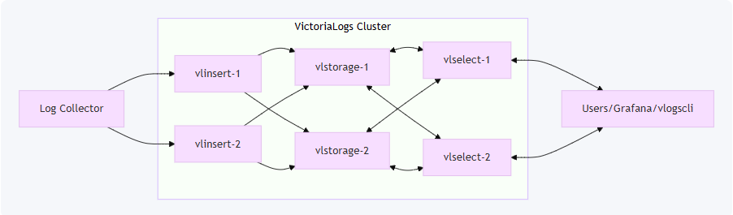
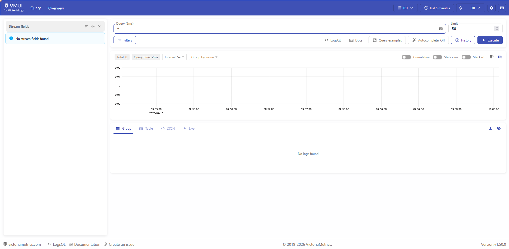

# Cài đặt VictoriaLogs Single-node
Single-node là cách đơn giản nhất để bắt đầu với VictoriaLogs. Bài viết này sẽ hướng dẫn cài đặt single node với binary kết hợp systemctl

Mô hình này phù hợp cho:

- môi trường local
- lab / dev / test
- hệ thống nhỏ và vừa
- production khi một máy vẫn đáp ứng đủ tài nguyên

- Tạo thư mục lưu file tệp lệnh nhị phân của viclogs
    
    ```bash
    sudo mkdir -p /opt/victorialogs
    ```
    
- Tạo thư mục lưu trữ dữ liệu của viclogs
    
    ```bash
    sudo mkdir -p /var/lib/victorialogs
    ```
    
- Cài đặt source code về ( bản 1.50 là bản mới nhất)
    
    ```bash
    cd /opt/victorialogs
    sudo curl -L -O https://github.com/VictoriaMetrics/VictoriaLogs/releases/download/v1.50.0/victoria-logs-linux-amd64-v1.50.0.tar.gz
    sudo tar xzf victoria-logs-linux-amd64-v1.50.0.tar.gz
    sudo chmod +x victoria-logs-prod
    ```
    
- Cấu hình với systemd
    
    ```bash
    vi /etc/systemd/system/victorialogs.service
    ```
    
    ```bash
    [Unit]
    Description=VictoriaLogs # Mô tả service (hiển thị khi dùng systemctl status)
    After=network.target # Chỉ khởi động service sau khi network đã sẵn sàng
    
    [Service]
    Type=simple  # Kiểu service: chạy foreground (không fork)
    User=victorialogs # Chạy bằng user 'victorialogs' (tăng bảo mật)
    Group=victorialogs # Group tương ứng
    WorkingDirectory=/opt/victorialogs # Thư mục làm việc mặc định khi service chạy
    
    ExecStart=/opt/victorialogs/victoria-logs-prod \ # Lệnh chạy chính
      -storageDataPath=/var/lib/victorialogs \       # Thư mục lưu dữ liệu log
      -retentionPeriod=90d \                         # Giữ log trong 90 ngày (tự xóa log cũ)
      -loggerFormat=json                             # Format log nội bộ của VictoriaLogs (dạng JSON)
    
    Restart=always   # Luôn restart nếu service bị crash
    RestartSec=5     # Delay 5 giây trước khi restart lại
    
    LimitNOFILE=65536  # Tăng số lượng file descriptor (quan trọng với hệ thống log nhiều kết nối)
    
    # Resource limits
    MemoryMax=4G # Tối đa được dùng 4G ram
    CPUQuota=90% # Tối đa dùng 90% CPU
    #AllowedCPUs=0,1 # Chỉ được phép dùng CPU thứ 0 và 1
    
    [Install]
    WantedBy=multi-user.target  # Cho phép service chạy ở runlevel bình thường (boot lên là chạy)
    ```
    
    ```bash
    sudo systemctl daemon-reload
    sudo systemctl enable --now victorialogs
    sudo systemctl status victorialogs
    ```

# Cài đặt VictoriaLogs Cluster-node

Cluster mode được sử dụng khi một node không còn đủ tài nguyên để xử lý log.

Mô hình này phù hợp cho:

- hệ thống có lượng log lớn
- cần scale ngang (horizontal scaling)
- production workload lớn
- cần tách ingest và query

VictoriaLogs cluster gồm 3 thành phần:

- **vlinsert**: nhận log từ agent
  - Dùng nhiều **CPU + network** do phải **nhận log liên tục, parse và phân phối (shard) log tới các storage node**
- **vlselect**: xử lý query
  - dùng nhiều **CPU + RAM**  do phải xử lý query, filter, aggregate và giữ kết quả trong memory
- **vlstorage**: lưu trữ dữ liệu log
  - dùng nhiều **disk + disk I/O** vì lưu trữ và đọc log → phụ thuộc lớn vào tốc độ disk (nên dùng SSD)
- **vmauth**: chỉ làm nhiệm vụ proxy / load balancing / auth



| Component   | Số VM | IP | CPU        | RAM        | Disk         |
|------------|------|------|------|------------|--------------|
| vlstorage  | 1+ | 172.16.66.50  | 2–4 cores  | 4–8 GB     | SSD (100GB+) |
| vlinsert   | 1+ | 172.16.66.49  | 2–4 cores  | 2–4 GB     | Không đáng kể |
| vlselect   | 1+ |172.16.66.48  | 4–8 cores  | 8–16 GB    | Không đáng kể |
| vmauth   | 1  |172.16.66.41  | 1-2 cores  | 1-2 GB    | Không đáng kể |

## Cài đặt chung ( trên tất cả VM ngoại trừ vmauth)

```bash
sudo mkdir -p /opt/victorialogs
sudo useradd --system --no-create-home --shell /usr/sbin/nologin victorialogs
sudo chown -R victorialogs:victorialogs /opt/victorialogs
cd /opt/victorialogs

sudo curl -L -O https://github.com/VictoriaMetrics/VictoriaLogs/releases/download/v1.50.0/victoria-logs-linux-amd64-v1.50.0.tar.gz
sudo tar xzf victoria-logs-linux-amd64-v1.50.0.tar.gz
sudo chmod +x victoria-logs-prod
```

## Cài đặt trên VM vlstorage

Tạo thư mục dữ liệu:
```bash
sudo mkdir -p /var/lib/victorialogs
sudo chown -R victorialogs:victorialogs /var/lib/victorialogs
```

Tạo service
```bash
sudo vi /etc/systemd/system/victorialogs-storage.service
```

```bash
[Unit]
Description=VictoriaLogs Storage
After=network.target

[Service]
User=victorialogs
Group=victorialogs
WorkingDirectory=/opt/victorialogs

ExecStart=/opt/victorialogs/victoria-logs-prod \
  -httpListenAddr=:9491 \
  -storageDataPath=/var/lib/victorialogs \
  -retentionPeriod=90d

Restart=always
LimitNOFILE=65536

[Install]
WantedBy=multi-user.target
```

Khởi động:
```bash
sudo systemctl daemon-reload
sudo systemctl enable --now victorialogs-storage
```

## Cài đặt trên VM vlinsert
Tạo service
```bash
sudo vi /etc/systemd/system/victorialogs-insert.service
```
```bash
[Unit]
Description=VictoriaLogs Insert
After=network.target

[Service]
User=victorialogs
Group=victorialogs
WorkingDirectory=/opt/victorialogs

ExecStart=/opt/victorialogs/victoria-logs-prod \
  -httpListenAddr=:9481 \
  -storageNode=<STORAGE_IP>:9491
  #-storageNode=172.16.66.50:9491,172.16.66.51:9491 # đối với nhiều storage

Restart=always
LimitNOFILE=65536

[Install]
WantedBy=multi-user.target
```

Khởi động:
```bash
sudo systemctl daemon-reload
sudo systemctl enable --now victorialogs-insert
```

## Cài đặt trên VM vlselect

Tạo service
```bash
sudo vi /etc/systemd/system/victorialogs-select.service
```
```bash
[Unit]
Description=VictoriaLogs Select
After=network.target

[Service]
User=victorialogs
Group=victorialogs
WorkingDirectory=/opt/victorialogs

ExecStart=/opt/victorialogs/victoria-logs-prod \
  -httpListenAddr=:9471 \
  -storageNode=<STORAGE_IP>:9491
  #-storageNode=172.16.66.50:9491,172.16.66.51:9491 # đối với nhiều storage

Restart=always
LimitNOFILE=65536

[Install]
WantedBy=multi-user.target
```

Khởi động:

```bash
sudo systemctl daemon-reload
sudo systemctl enable --now victorialogs-select
```


Truy cập UI của victorialogs
```bash
http://<IP_vlselect>:9471/select/vmui/
```



## Cài đặt VM vmauth

Nếu bạn triển khai nhiều nhiều vlinsert, vlselect, vlstorage thì cần phải đặt đứng trước chúng 1 vmauth để luôn chuyển dữ liệu


Chuẩn bị thư mục

```bash
sudo mkdir -p /opt/vmauth /etc/vmauth
cd /opt/vmauth
```

Tải source code về:

```bash
VER=$(curl -s https://api.github.com/repos/VictoriaMetrics/VictoriaMetrics/releases/latest \
  | grep tag_name | cut -d '"' -f4)

sudo curl -fL -o vmutils.tar.gz \
  "https://github.com/VictoriaMetrics/VictoriaMetrics/releases/download/${VER}/vmutils-linux-amd64-${VER}.tar.gz"
tar xzf vmutils.tar.gz
sudo install -m 755 vmauth-prod /usr/local/bin/vmauth
```

Tạo file config:
```bash
sudo tee /etc/vmauth/auth.yml > /dev/null <<'EOF'
unauthorized_user:
  url_map:
    - src_paths: ["/insert/.*"]
      url_prefix:
        - "http://172.16.66.49:9481"
    - src_paths: ["/select/.*"]
      url_prefix:
        - "http://172.16.66.48:9471"
EOF
```

Hoặc đặt password với user cho vmauth:

```
#unauthorized_user:
users:
  - username: admin
    password: Minhtenlaquang99
    url_map:
      - src_paths: ["/insert/.*"]
        url_prefix:
          - "http://172.16.66.49:9481"
      - src_paths: ["/select/.*"]
        url_prefix:
          - "http://172.16.66.48:9471"
```

Chạy test thử để kiểm tra:

```bash
/usr/local/bin/vmauth \
  -auth.config=/etc/vmauth/auth.yml \
  -httpListenAddr=:8427
```

Truy cập vào link để kiểm tra kết quả:
```
http://172.16.66.41:8427/select/vmui
```

Tạo user và phân quyên sử dụng vmauth:

```
sudo useradd --system --no-create-home --shell /usr/sbin/nologin vmauth || true
sudo chown -R vmauth:vmauth /etc/vmauth
sudo chmod 750 /etc/vmauth
```

Tạo service `vmauth` để kết hợp sử dụng systemctl
```
sudo tee /etc/systemd/system/vmauth.service > /dev/null <<'EOF'
[Unit]
Description=VictoriaMetrics vmauth for VictoriaLogs
After=network.target

[Service]
User=vmauth
Group=vmauth
Type=simple
ExecStart=/usr/local/bin/vmauth -auth.config=/etc/vmauth/auth.yml -httpListenAddr=:8427
Restart=always
RestartSec=5
LimitNOFILE=65536

[Install]
WantedBy=multi-user.target
EOF
```

Bật dịch vụ:

```
sudo systemctl daemon-reload
sudo systemctl enable vmauth
sudo systemctl restart vmauth
sudo systemctl status vmauth
```

## Kiểm thử với vector:
`/etc/vector/vector.yaml`

```
sources:
  vcenter_syslog:
    type: syslog
    address: 0.0.0.0:514
    mode: udp
sinks:
  victorialogs:
    type: http
    inputs:
      - vcenter_syslog
    uri: "http://172.16.66.41:8427/insert/jsonline?_msg_field=message&_stream_fields=host,appname,severity"
    method: post

    auth:
      strategy: basic
      user: admin
      password: Minhtenlaquang99
    encoding:
      codec: json
    framing:
      method: newline_delimited
```